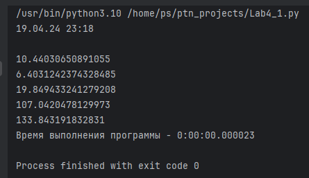
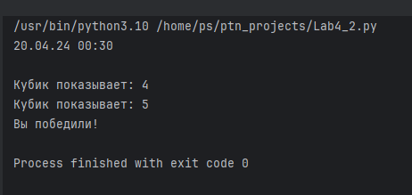
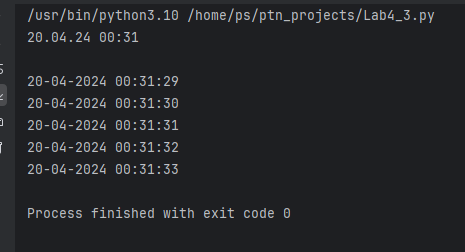
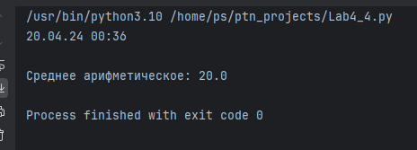
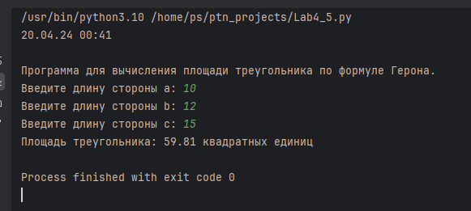

# Тема 4. Функции и модули
Отчет по Теме #4 выполнил:
- Синкевич Артём Станиславович
- ИНО ОЗБ ПОАС-22-1

| Задание    | Сам_раб |
|------------|---------|
| Задание 1  | +       |
| Задание 2  | +       |
| Задание 3  | +       |
| Задание 4  | +       |
| Задание 5  | +       |

знак "+" - задание выполнено; знак "-" - задание не выполнено;

Работу проверили:
- к.э.н., доцент Панов М.А.

## Самостоятельная работа №1
###  a

```python

```
### Результат


## Самостоятельная работа №2
### a

```python

```
### Результат


## Самостоятельная работа №3
### a

```python

```
### Результат


## Самостоятельная работа №4

```python

```
### Результат



## Самостоятельная работа №5
### Составьте программу, результатом которой будет данный вывод в консоль:

```python

```

### Результат

